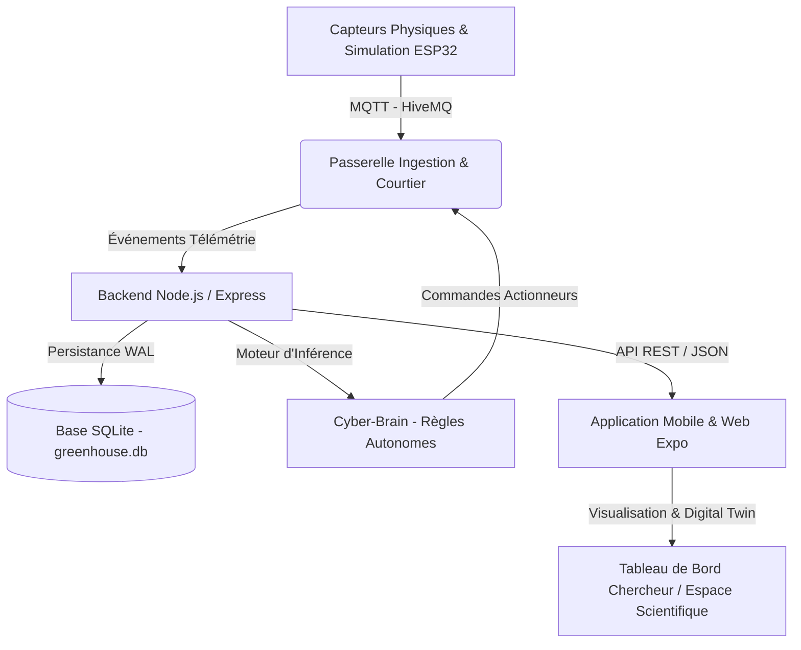

# 🌿 CyberCortex ERP — Smart Agri Greenhouse Digital Twin Platform

[](https://expo.dev/)
[](https://reactnative.dev/)
[](https://nodejs.org/)
[](https://sqlite.org/)
[](https://hivemq.com/)
[](LICENSE)

Système cyber-physique complet de gestion, simulation prédictive et pilotage autonome d'une serre agricole intelligente hydroponique (Projet de Fin d'Études).

---

## 🏛️ Architecture du Système



Le projet est structuré en **3 couches interconnectées** :

1. **Couche Embarquée & IoT (`sketch.ino`)** :
   - Firmware ESP32 (compatible simulateur Wokwi et matériel réel).
   - Ingestion des données capteurs (DHT22, humidité du sol, pH/EC, luminosité).
   - Communication bidirectionnelle via protocole MQTT vers broker HiveMQ.

2. **Couche Backend & Moteur d'Inférence (`backend/`)** :
   - Serveur Node.js & Express avec persistance SQLite haute performance en mode WAL.
   - Moteur décisionnel **Cyber-Brain** : évaluation de règles autonomes en temps réel et pilotage des actionneurs (pompe, ventilation, éclairage horticole).
   - API REST complète pour la télémétrie, l'historique des alertes, et la persistance du profil scientifique.

3. **Couche Applicative & IHM (`frontend/`)** :
   - Application cross-platform (iOS, Android, Web) développée avec **React Native** et **Expo Router**.
   - **Jumeau Numérique (Digital Twin)** et télémétrie temps réel.
   - **Module de Simulation Prédictive** avec projection de rendement, crosshair et infobulle interactive (`react-native-gifted-charts`).
   - **Espace Scientifique** : gestion d'habilitation et sélecteur territorial exhaustif des **24 gouvernorats tunisiens**.

---

## 📁 Structure du Projet

```text
PFE/
├── backend/                  # Serveur REST & Moteur Cyber-Brain
│   ├── config/               # Configuration base de données et environnement
│   ├── controllers/          # Contrôleurs métier (Actionneurs, Alertes)
│   ├── routes/               # Routes API unifiées (/api/telemetry, /api/user, etc.)
│   ├── services/             # Client MQTT et service de rétention
│   ├── database.js           # Gestionnaire SQLite avec schémas et migrations
│   ├── server.js             # Point d'entrée du serveur Node.js
│   ├── Dockerfile            # Conteneurisation Docker
│   └── docker-compose.yml    # Déploiement multi-services
│
├── frontend/                 # Application Mobile & Web (Expo / React Native)
│   ├── app/                  # Routes Expo Router ((tabs), digital-twin, etc.)
│   ├── components/           # Composants UI, Cartes capteurs, Espace Scientifique
│   │   ├── PredictiveSimulationView.tsx  # Graphique prédictif & Tooltip interactif
│   │   └── ScientificSpaceScreen.tsx     # Profil & Sélecteur 24 gouvernorats
│   ├── constants/            # Thèmes graphiques, configuration et référentiel territorial
│   │   └── governorates.ts   # Liste officielle des 24 gouvernorats tunisiens
│   ├── services/             # Clients d'appels API REST backend
│   └── types/                # Déclarations TypeScript strictes
│
├── .vscode/                  # Extensions recommandées pour le workspace
│   └── extensions.json
├── sketch.ino                # Code source firmware ESP32 (Wokwi / Hardware)
├── .gitignore                # Exclusion des artefacts, node_modules et caches
└── README.md                 # Documentation globale du projet
```

---

## 🚀 Démarrage Rapide

### 1. Prérequis
- [Node.js](https://nodejs.org/) (v18 ou supérieur, v20+ recommandé)
- [npm](https://www.npmjs.com/) ou [yarn](https://yarnpkg.com/)
- [Git](https://git-scm.com/)

---

### 2. Lancement du Backend

```bash
# 1. Accéder au répertoire backend
cd backend

# 2. Démarrer le serveur API & MQTT
node server.js
```

Le serveur démarre sur **`http://localhost:5000`** :
- Healthcheck : `http://localhost:5000/api/health`
- Profil utilisateur : `http://localhost:5000/api/user/profile`

---

### 3. Lancement de l'Application Mobile / Web

```bash
# 1. Accéder au répertoire frontend
cd frontend

# 2. Démarrer le serveur de développement Expo
npx expo start --web
```

L'application s'ouvre dans votre navigateur sur **`http://localhost:8081`** ou sur mobile via l'application **Expo Go**.

---

### 4. Simulation Firmware IoT (ESP32)
Le fichier `sketch.ino` peut être directement simulé sur [Wokwi](https://wokwi.com/) ou flashé sur un microcontrôleur ESP32 physique :
- Broker MQTT : `broker.hivemq.com:1883`
- Topic de télémétrie : `ghost-pfe/greenhouse/telemetry`

---

## 🛠️ Stack Technologique

| Domaine | Technologies |
| :--- | :--- |
| **Frontend Mobile / Web** | React Native 0.86, Expo SDK 57, Expo Router, TypeScript, React 19, Gifted Charts |
| **Backend API** | Node.js, Express 5, Better-SQLite3 / DatabaseSync, MQTT.js |
| **Base de Données** | SQLite 3 (Mode WAL optimisé pour environnement embarqué Edge) |
| **IoT & Télémétrie** | ESP32, PubSubClient, ArduinoJson, Broker MQTT HiveMQ, Wokwi |
| **DevOps & Outils** | Docker, Docker Compose, VS Code Extensions Pack |

---

## 👨‍💻 Auteur
- **Montassar Chraigui** ([@montassarchraigui99-ops](https://github.com/montassarchraigui99-ops))
- Projet de Fin d'Études (PFE) — Ingénierie des Systèmes Intelligents & IoT.
